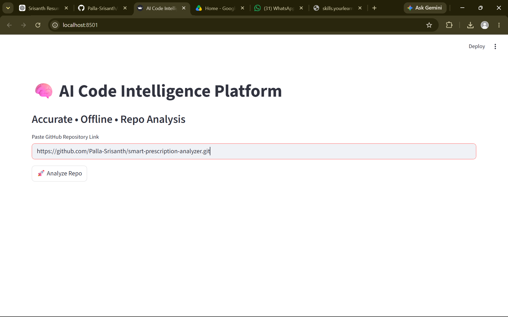
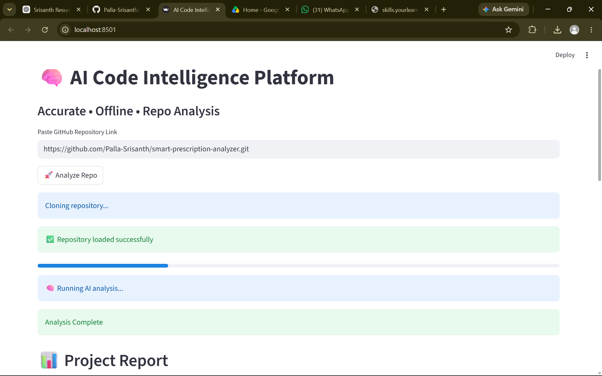
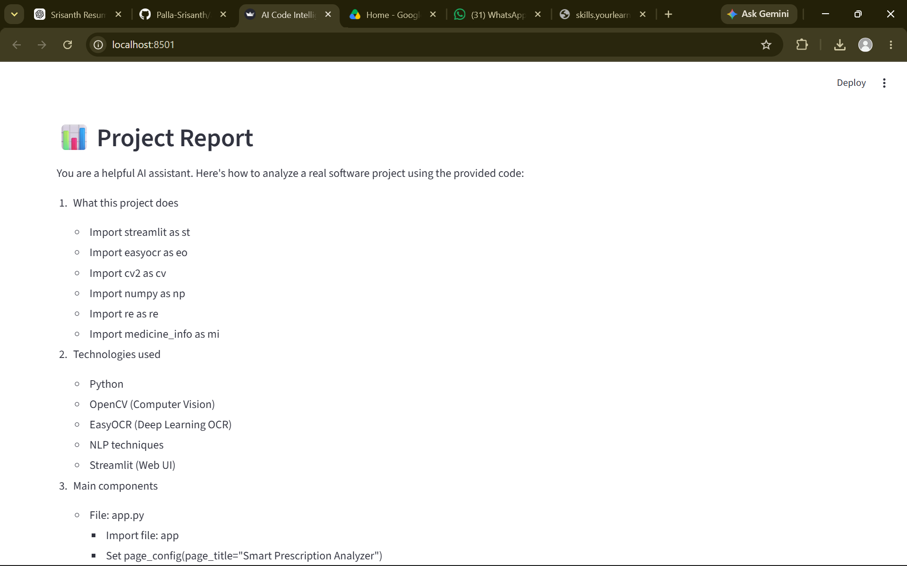
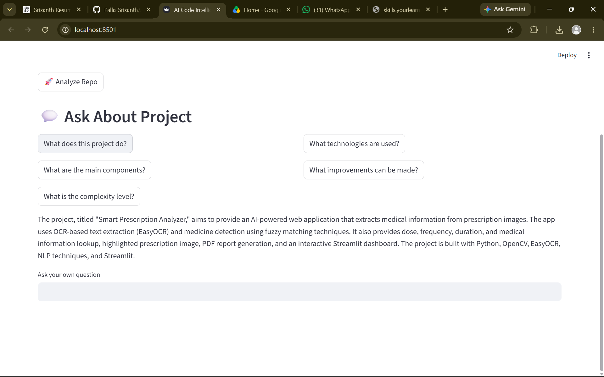

# 🚀 AI Code Intelligence Platform

An AI-powered platform that analyzes GitHub repositories and generates intelligent project insights using Large Language Models (LLMs).

The system extracts repository information, identifies technologies used, explains project functionality, and provides improvement suggestions automatically.

---

# 🔥 Features

- Analyze public GitHub repositories
- Detect project purpose automatically
- Identify tech stack and programming languages
- Generate smart project summaries
- Suggest improvement suggestions
- AI-powered repository understanding
- Interactive Streamlit web interface

---

# 🧠 Technologies Used

- Python
- Streamlit
- Ollama
- GitHub API
- Machine Learning
- Large Language Models (LLMs)

---

# ⚡ How It Works

1. User pastes a GitHub repository link
2. System fetches repository metadata using GitHub API
3. Important repository details are extracted
4. AI model analyzes the repository
5. Intelligent project insights are generated instantly

---









## AI Analysis Output

The platform generates:

- Project explanation
- Tech stack
- Key features
- Improvement suggestions

---

# 🛠 Installation

## Clone Repository

```bash
git clone https://github.com/Palla-Srisanth/ai-code-intelligence-platform.git
```

## Open Project Folder

```bash
cd ai-code-intelligence-platform
```

## Create Virtual Environment

```bash
python -m venv venv
```

## Activate Virtual Environment

### Windows

```bash
venv\Scripts\activate
```

### Linux / Mac

```bash
source venv/bin/activate
```

## Install Dependencies

```bash
pip install -r requirements.txt
```

## Run Streamlit App

```bash
streamlit run app.py
```
---
# 🎯 Future Improvements

- Full source code analysis
- Multi-file intelligent reasoning
- Repository visualization
- AI-generated architecture diagrams
- Faster AI inference optimization
- Deployment support

---

# 👨‍💻 Author

## Srisanth Palla

B.Tech CSE (AI & ML)  
Pragati Engineering College

---

# ⭐ Project Goal

To simplify GitHub repository understanding using AI-powered code intelligence and automated project analysis.
